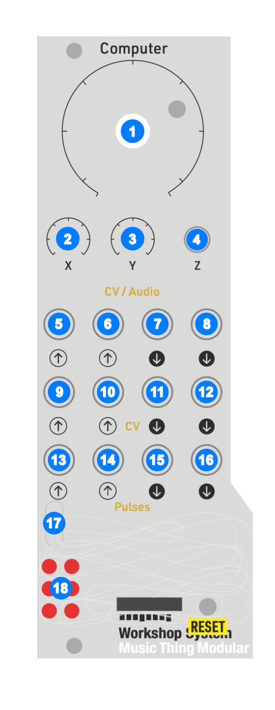

# Knots

Knots is a six-engine oscillator firmware for the Music Thing Workshop System that turns is into a bank of interesting, selectable engines. 

The Main knob sets pitch, X and Y shape the current engine, and the Z switch lets you flip into an Alt move or move to the next slot.

The rest of the ins and outs and the USB MIDI make it easy to integrate with the rest of to the rest of the Workshop System and your your music making gear. Its built to be played, patched and connected.

## Inputs, Outputs and Control
All the inputs and outputs serve a musical purpose and can (and should) be use to get to new and interestings sounds.

#### [1] Main Knob
Used for tuning the main oscillator of all the engines. It's a 10 octave span from 10Hz to 10KHz, clamped at either end so CV or MIDI input won't push it past those min and max values. 

#### [2] + [3] The X and Y Trimmers
The X and Y trimmers adjust 2 parameters exposed by the engines. These differ per engine and, in some cases, are different in the Alt mode. The parameters are musical to encourage their use.

The X trimmer has an additional function used in conjunction with the Z switch.

#### [5] + [6] X and Y Inputs
Below the X and Y trimmers are the two audio inputs. The inputs can accept values from -6v to 6v. If there is a cable connected, the X and Y trimmers become *attenuators* for the CV signal on the input cable. These inputs run at control rate, not at the full audio rate. 

> Tip: The Workshop System's Slopes modules, when running in Loop mode with nothing connected to the input, will output 0v to 12v. This is not ideal when connect to the X and Y iputes, but there is a workaround for this, see CV Out 2 **[12]**. However the built-in SineSquare Oscillators do map to the ±6v range and sound great as modulators.

#### [4] The Z Switch
The Z switch does 4 things:

1. In the *middle* position, the module is in the Normal mode, with normal outputs on Audio Out 1 + 2  
2. In the *up* position, the module is in the Alt mode, with alternative outputs on Audio Out 1 + 2  
3. Pushing the momentary switch *down* and returning to the *middle* will move the engine to the next slot, and change the LED.   
   _**Note:* the change happens when you release the Z switch, not when you push it down, to allow for the clock stuff._
4. Holding the switch *down* and moving the X trimmer will adjust the speed of the clock output from Pulse Out 2.

#### [7] + [8] Audio Out

Audio Out 1 and 2 are the two outputs for the module and will either output the Normal mode or Alt mode, depending on the Z switch position. They are can be used as dual mono or as a stereo pair.

> Tip: Pan the outputs left and right out the Workshop Thing mixer, its sounds great!!

#### [9] CV In 1
A 1v per Octave CV input connected to the main tuning. It works relative to the Main knob position but doesn't exceed the 10Hz - 10KHz range limit.

> Tip: It's fun to connect the SineSquare Oscillators to this input. However there is no attenuator for it, but you can pass the oscillator's output through the Stompbox section and use the Blend knob to attenuate the signal. CV In 1 runs at control rate - approx 1kHz - so you can get FM-ish sounds this way but it's not full on FM.

#### [10] CV In 2 
CV In 2 acts like a standard VCA for both outputs. The input responds to signals in the 0-5v range. Zero and below mutes both outputs. 5v and above (up to the 6v limit) sets unity gain for the outputs. It's also set to unity gain if nothing is plugged in. 

***Note:** the Ring Mod on the Workshop System can also be used as a VCA, but then you don't get stereo and you no longer have a ring modulator. This frees it up for additional weirdness!*

> Tip: Patching Pulse Out 1 **[15]** to CV In 2 **[10]** while sending MIDI will gate the outputs to note on/off messages. And if you patch Pulse Out 1 **[15]** into a Slope input on the Workshop System and then into CV In 2 **[10]**, you can create variable envelopes to shape the begining and end of the notes.

#### [11] CV Out 1
This passes the MIDI note value out in 1v per Octave format. This is independent of the Main knob position or CV In 1 so it's a direct MIDI to CV mapping. Handy for sending MIDI sequences to other oscillators.

#### [12] CV Out 2
CV Out 2 is a secret weapon! It is connected internally to MIDI CC 74, so you can send MIDI Control Change messages from your DAW/MIDI sequencer and control anything that accepts a -5 to 5v input. MIDI CC is limited to 128 steps, so it might be a bit too jagged for precision requirements.

When the module restarts or the MIDI CC 74 value is set to 0, it will output -5v which can be very useful on the Workshop System.

> Tip: The SineSquare Oscillators can become LFOs if you patch the -5v coming out of CV Out 2 into the Pitch In. They will run a lot slower!

> Tip: The Slopes are a type of variable slew rate limiter and you can change them from the default 0-12v output to -5v to 7v range by patching the -5v coming out of CV Out 2 **[12]** into the Slope input, make sure it's not the Slope's CV In. This is useful for getting another LFO.

#### [13] Pulse In 1
When plugged in it overrides the Z up/middle position setting and switches the module between Normal mode with a low input (0v) and Alt mode with a high input (5v).

#### [14] Pulse In 2
When plugged in it overrides the Z momentary down/middle position setting and advances to the next engine on each new rising edge (0 to 5v).

> Tip: Connecting the SineSquare Oscillators square outputs to these Pulse inputs for some rythmic fun!

#### [15] Pulse Out 1
This follows the MIDI gate on/off, going high (5v) while the note is held.

#### [16] Pulse Out 2
This is the other secret weapon. Pulse Out 2 is a clock output that can drive sequencers, delays or just make interesting rhythmic patterns. The speed of the clock can be adjusted by holding the Z switch down and turning the X trimmer. Once you've turned the X knob while holding Z down, the engine slot won't advance when you release Z.

The clock rate goes from 20 - 999 BPM. If there is a MIDI clock present at the USB MIDI interface, the clock output will follow the MIDI clock and the X knob changes the divisions applied.

| Division | Rate |
| :---- | :---- |
| 24 | 1/4 note |
| 12 | 1/8 note |
| 8 | 1/8 note triplet |
| 6 | 1/16 note |
| 4 | 1/16 note triplet |
| 3 | 1/32 note |
| 2 | 1/32 triplet |
| 1 | raw 24 PPQN clock |

The output is a ±5ms, 5v pulse for each clock tick. This was tested with a Moog DFAM and it drives the sequencer as expected!

> Tip: Plugging Pulse Out 2 **[16]** output into a Slope input lets you maintain a tempo for the Slope output but adjust the slope's angles for interesting rhythmic timbre changes.

#### [17] USB
The USB input is simply a class-compliant MIDI interface. It only does MIDI note value, on/off and MIDI CC 74. The note value is a "last note wins" implementation. The CV Out 1 **[9]** and Main knob **[1]** tuning keep the last value too. The MIDI input is hardcoded to MIDI channel 1.

#### LEDs
This shows the currently selected engine and flashes briefly when receiving MIDI notes.

## The 6 Engines
I came up with these names after a few beers and some fine Dutch herbs. Not my best work but I stand by them.

#### Sawsome
It's a supersaw implementation with 7 saw waves spread across the stereo field.

*Normal Mode*  
This is the saw wave mode, with 7 saw waves made using a wrapping phase accumulator, which creates a ramp, with bandlimiting to deal with aliasing. 

**X** controls the stereo spread between the two outputs and **Y** controls the amount of detune. Both go from 0 at full CCW to the maxium at full CW.

*Alt Mode*  
This is a super triangle mode, which is the same thing but with triangle waves. 

**X** and **Y** do the same thing.

#### Bender
A combination wavefolder and bitcrusher.

*Normal Mode*  
2 sine waves are generated with one wave going through a wavefolder to Audio Out 1 **[7]** and the other going through a bitcrusher to Audio Out 2 **[7]**. 
**X** is the amount of folding and **Y** is the amount of crushing.

*Alt Mode*  
In Alt Mode the wavefolder is routed through an additional bitcrusher first before going to output and vice versa.

**X** is the amount of folding for both folders and **Y** is the amount of crushing for both bitcrushers.

#### Floatable
A wavetable oscillator with 2 wavetables based on 16 x 256 sample [AKWF](https://www.adventurekid.se/akrt/waveforms/adventure-kid-waveforms/) single-cycle waves. One wavetable per mode, i.e. Normal and Alt modes use different wavetables.

Move through wavetables (with interpolation) using the X and Y knobs, sending the X position wave to Audio Out 1 **[7]** and Y position Audio Out 2 **[7]**. This creates an interesting stereo field.

- [ ] TO-DO, picture of the tool goes here.

#### Cumulus
This and additive oscillator with 16 partials with *bump* and *slope* shaping controls and an additional centroid option in Alt mode.

*Normal Mode*  
**X** moves the *bump* from the first partial to the last. This is interpolated between partials to be smooth, but it can sound like it's stepping when the slope is steep. **Y** sets the *slope* from very steep at full CCW, where only the 2 partials closest to the *bump* position are active, to flat at full CW, where all partials have the same gain. 

- [ ] TO-DO, picture of the bump and slope goes here.

*Alt Mode*  
Alt mode implements a "centroid" feature that can change the frequencies of the partials. Using the *bump*, i.e. the **X** position, as the central point, **Y** will additionally modify the partial frequencies to **move in** toward the *bump* position going CCW and **move out** to the edges (partial 1 and 16) and bouncing back in going CW. Try it, it sounds very cool!

- [ ] TO-DO, picture of the bump and slope plus harmonic shift goes here.

#### Losenge
This a vowel sound / vocal oscillator. It uses 3 *formant* oscillators running at fixed frequencies. There are 2 x sine waves and a square wave. These are running at the 3 formant frequencies for the specific vowel sound we want to make. For *A* it's a sine wave at 609Hz, another at 1000Hz and the square running at 2450Hz. These are then summed/mixed together at gain values of 1, 0.5 and 0.251 respectively. The frequency and gain values vary per vowel and there are tables with all these values in the code.

There is also the primary phase increment ramp oscillator, with its frequency attached to the Main knob and other frequency modifiers, known as the "glottal envelope" that does 2 things:

1. It applies amplitude modulation to the 3 summed formant oscillators.  
2. It resets the phase of all 3 of the formant oscillators every time it wraps, like oscillator sync.

- [ ] TO-DO, picture of this implementation

This gives the impression of an overall fundamental frequency being applied to the 3 formant oscillators that can be shifted around while keeping the underlying vowel consistent. By changing the frequency and gain values of the formant oscillators independently from the main glottal envelope, you get the singing voice timbre of the Losenge engine.

*Normal Mode*   
This runs the 3 formant oscillators at F1, F2 and F3 for the associated vowel. ***Note:** This is the mapping for a male voice*

| Vowel | F1 (Hz) | F2 (Hz) | F3 (Hz) |
| :---- | ----: | ----: | ----: |
| A | 609 | 1000 | 2450 |
| E | 400 | 1700 | 2300 |
| IY | 238 | 1741 | 2450 |
| O | 325 | 700 | 2550 |
| U | 415 | 1400 | 2200 |

**X** morphs the formant frequency and gain values between the vowels, moving from A > E > IY > O > U over the range of the knob.

**Y** changes the F1 value but keeps the ratios between them the same, which changes it from sounding darker/lower at full CCW to brighter/higher at full CW.

*Alt Mode*  
This is the brighter upper-formant table. It replaces the base `F1/F2/F3` set with an upper `F2/F3/F4` value.

| Vowel | F2 (Hz) | F3 (Hz) | F4 (Hz) |
| :---- | ----: | ----: | ----: |
| A | 1000 | 2450 | 3300 |
| E | 1700 | 2300 | 3500 |
| IY | 1741 | 2450 | 3300 |
| O | 700 | 2550 | 3400 |
| U | 1400 | 2200 | 3300 |

An early iteration used the frequency mapping for a female voice for Alt mode, but it didn't sound that different to Normal mode when keeping the fundamental glottal envelope frequency the same.

#### Din Sum
Where Bender is the distortion module, this is the noise module. Both modes are based on an oscillator that morphs between a sine wave and saw wave in noisy way.

*Normal Mode*  
In Normal mode the transition is an interpolation between the 2 waves with added noise. **X** controls the position between the 2 waves. Sine wave at full CCW and a saw wave at full CW. As you move **X** the interpolation point moves between the sine wave and saw wave with a random variation around the interpolation point. The mid point of **X** is halfway between the 2 waves and starts sounding like pitched noise. 

**Y** changes the noise from low-passed noise at full CCW for a smoother, more controlled sound, to high-passed noise at full CW for a jittery, buzzy sound.

For Audio Out 2 the saw wave is phase shifted 90 degrees to give a sense of widening stereo as you move **X**.

- [ ] TO-DO, picture of the normal mode

*Alt Mode*   
In Alt mode the output switches between a sine wave and saw wave randomly, but only when the waveform cycle repeats. This way you will always either get one full sine wave or one full saw wave, randomly chosen.

**X** biases the randomness towards the sine wave going CCW and towards the saw wave going CW. The midpoint is 50/50. **Y** is the *rate* of switching, or rather how long a wave is held before it's allowed to change. From slow blips at full CCW to flickering at full CW.

- [ ] TO-DO, picture of the alt
